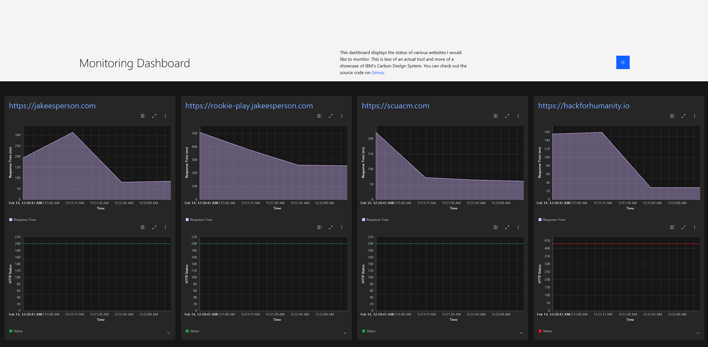
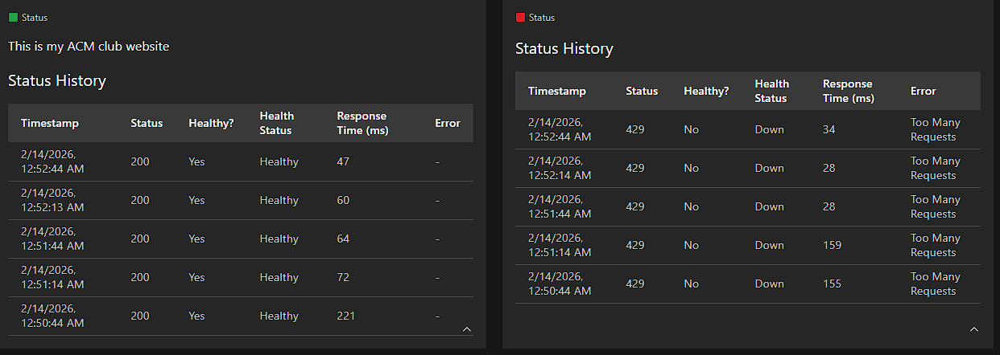

# IBM Monitoring Dashboard

Live Link: [https://ibm-web-dashboard.26chxq0unyqg.us-east.codeengine.appdomain.cloud](https://ibm-web-dashboard.26chxq0unyqg.us-east.codeengine.appdomain.cloud)





This project is a web-based monitoring dashboard built with React for the frontend and Node.js with Express for the backend. It provides real-time status updates and historical data visualization for multiple websites I care about.

I used IBM's Carbon Design System for the UI components and Code Engine for hosting. This was a very smooth experience and I really like the components of Carbon. The skeleton components were especially nice for loading states, which automatically refresh every 30 seconds. There's also light and dark mode support, which was the smoothest with Carbon.

## Setup

Just use a docker container bro

```bash
docker build -t <your-image-name>:latest .
docker run -p 8080:8080 <your-image-name>:latest
```

Then open your browser and navigate to `http://localhost:8080` to see the dashboard in action. If you clone this, put in your own websites in `backend/index.js`.
